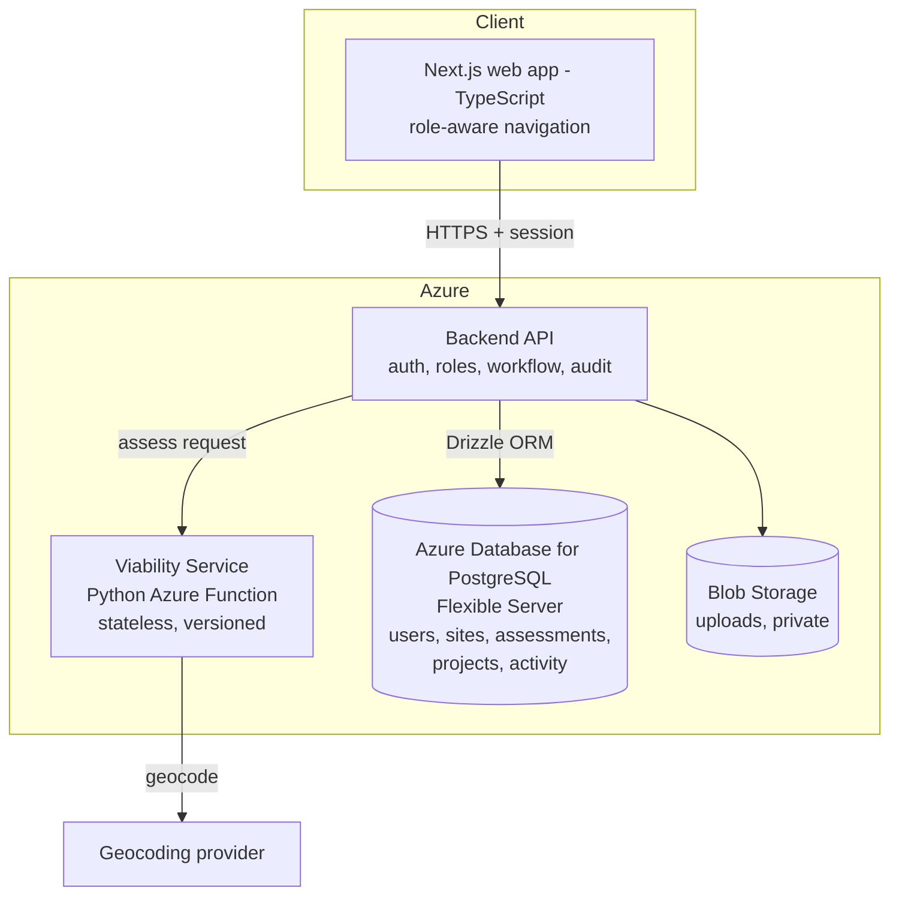
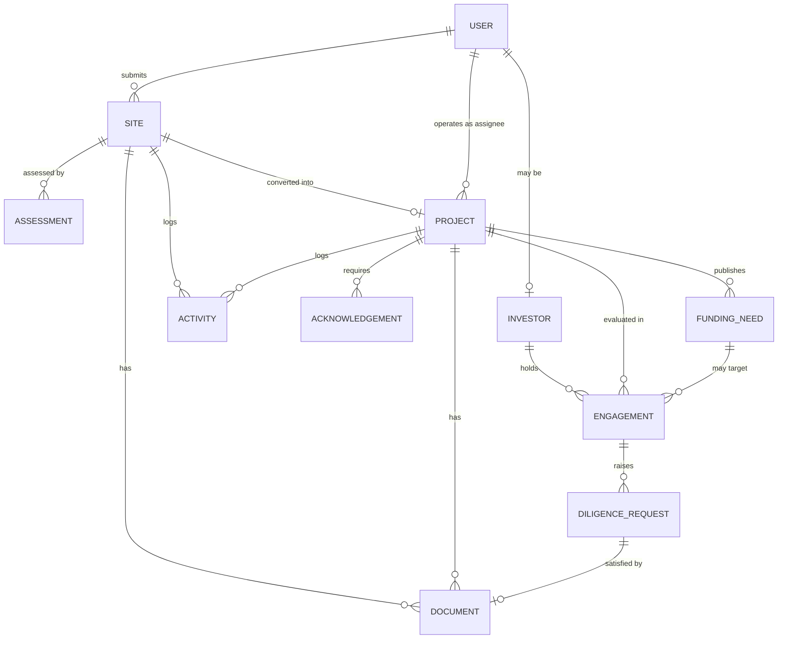
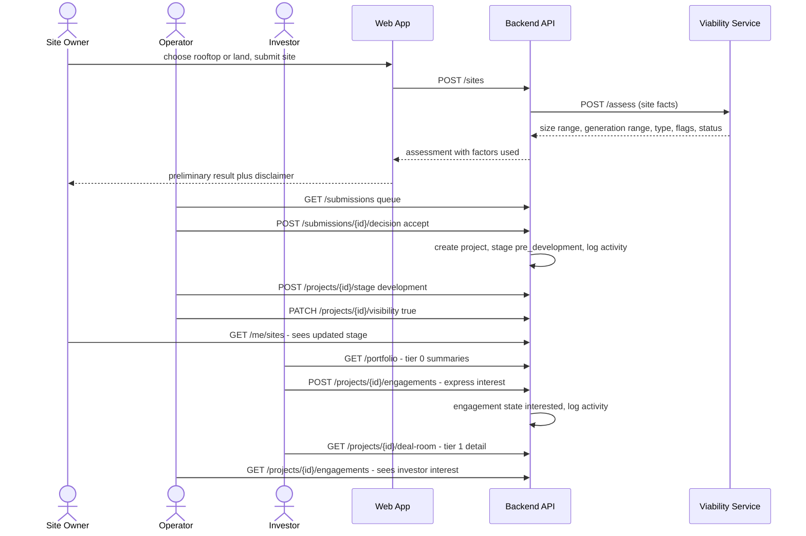
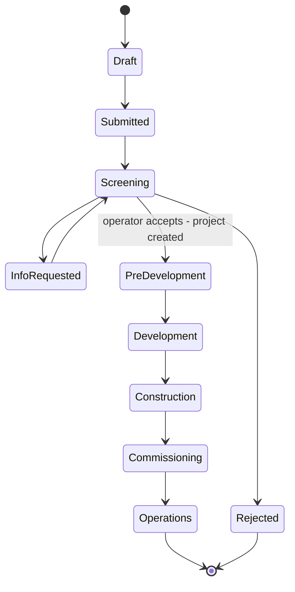
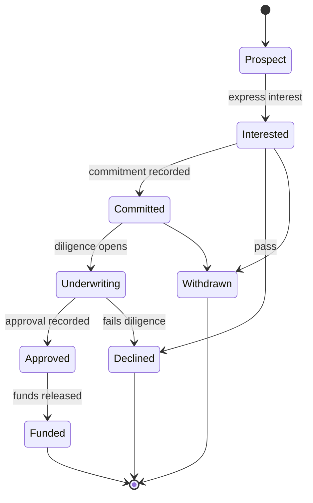

# Sun Sum Solar Technical Design

## 1. Summary

SunSum Solar is envisioned as the software platform that brings together many smaller distributed energy resource opportunities, such as community-scale rooftop and land-based solar projects, and manages them as a unified portfolio that can ultimately participate as a Virtual Power Plant (VPP).

The core challenge SunSum is addressing is one of scale and access. Large corporate and institutional energy buyers typically look for energy opportunities that can provide meaningful volume. An individual community-scale rooftop, small business, apartment building, farm, or parcel of land may represent a valuable renewable-energy opportunity, but on its own it may be too small to meet the scale expected by a large energy buyer.
At the same time, smaller solar developers face challenges on the other side of the ecosystem. Before a solar project can move forward, developers may need to perform feasibility analysis, site assessment, engineering, financial modeling, and other pre-development activities. For smaller projects, the potential development fees may not always justify these upfront costs, making otherwise promising community-scale opportunities difficult to pursue.

SunSum Solar is intended to help bridge these two gaps through aggregation and a standardized project-development workflow

## 2. Scope

### 2.1 In scope

1. **Landing Page and Guided Journey** - Guide users to the appropriate experience based on their role and objective.
2. **Site Submission Intake** - Capture rooftop or land opportunities through a guided workflow with draft-save, required site information, and supporting document uploads.
3. **Preliminary Viability Assessment** - Provide a transparent and configurable assessment with supporting factors, while allowing operator review and override with rationale.
4. **Site Owner Dashboard** - Give site owners visibility into submission status, viability results, outstanding information, project stage, and next actions.
5. **Operator Dashboard and Project Pipeline** - Provide a centralized submission queue, review and decision workflows, project lifecycle management, pipeline visibility, and visibility controls.
6. **Documents and Acknowledgements** - Support document uploads, required-document checklists, acknowledgements, and simulated signatures for the MVP.
7. **Investor Portfolio and Deal Room** - Allow investors to onboard with an investor type and mandate, discover investment-ready projects through a portfolio view, review detailed project information and supporting documents in a project-level deal room, and express interest in opportunities they want to evaluate further.
8. **Investor Engagement Lifecycle** - Model the investor journey from interest through commitment, underwriting, approval and funding, with progressive disclosure of project information by engagement state. The MVP builds the interest stage; later states are specified but not implemented (§7.8).

### 2.2 Out of scope

- Live utility / Georgia Power integration
- Grid dispatch and device control
- Real-time inverter integration
- Utility interconnection processing
- PPA / off-taker matching
- Automated investor underwriting and financing
- Capital-stack management and financial close
- Binding commitments and movement of funds
- REC settlement or tokenization
- Contractor procurement
- Production legal agreements
- Multi-country configuration

### 2.3 Definition of success

| # | Charter success criterion | Verifiable acceptance test |
|---|---|---|
| S1 | One deployed application URL | Demo URL returns 200 over HTTPS from a clean browser |
| S2 | Three role-based experiences | Each role sees its own navigation and is denied the others' endpoints server-side |
| S3 | ≥ 3 seeded Atlanta pilot sites in both operator pipeline and investor portfolio | Seed script run on empty DB yields ≥ 3 projects in both views |
| S4 | One new submission completed live | End-to-end test: intake → assessment → operator accept → project → investor sees it |
| S5 | Transparent preliminary viability result | Result page lists every factor used + ruleset version + preliminary-only disclaimer |
| S6 | Functioning operator review workflow | Accept / reject / request-info each persist a decision + activity entry |
| S7 | Visible project-status timeline across all three roles | Same project stage renders consistently in all three role views |
| S8 | Investor portfolio with ≥ 1 open deal room | Investor opens deal room and sees viability factors behind the screen |

---

## 3. Technology stack

| Area | Tech Stack | Reason |
|---|---|---|
| Frontend | Next.js, TypeScript | Retain the proposed UI and shared types. |
| UI and forms | Tailwind; shadcn/ui or Material UI; consider TanStack Form | Reuse components and validation. |
| Backend | Next.js/Node.js server endpoints; Drizzle ORM with a PostgreSQL driver | Keep workflow logic and typed database access in the same TypeScript codebase. |
| Database | Azure Database for PostgreSQL Flexible Server | Selected transactional source of truth for the MVP; Fabric mirroring is optional and tier-dependent. |
| Schema and migrations | Drizzle Kit | Generate versioned SQL migrations from the TypeScript schema for review and application. |
| Documents | Private Azure Blob Storage | Controlled file access with linked site/project metadata. |
| Identity | Entra ID demo accounts; External ID for public signup | Microsoft sign-in; application-enforced roles. |
| Local orchestration | Aspire AppHost, when added | Coordinate local dependencies without coupling development to the Azure hosting choice. |
| Hosting | Azure App Service, Linux code deployment | Host the Next.js application; the F1 smoke test does not require a container registry. |
| Secrets | Key Vault + managed identities | Protect remaining secrets; avoid stored service credentials where supported. |
| CI/CD | GitHub Actions for CI; employee-authenticated App Service deployment for the smoke test | Validate changes without assuming GitHub-to-Azure federation is configured. |
| Monitoring | Application Insights/OpenTelemetry; Aspire Dashboard locally | Health, logs, and traces. |
| Analytics | Fabric Mirroring, OneLake, optional Power BI | Reporting without coupling the live app to analytics. |
| Design / planning | Figma/FigJam; GitHub Issues or Linear | Clear handoffs and a lightweight backlog. |

### 3.1 Database decision

**Decision, September 16, 2026: use Azure Database for PostgreSQL Flexible
Server with Drizzle ORM.** Use Drizzle's PostgreSQL integration for server-side
data access and Drizzle Kit for schema and migration tooling. The underlying
PostgreSQL driver and connection/authentication configuration remain to be
selected during implementation.

PostgreSQL will hold the relational application records and document metadata.
Original PDFs, spreadsheets, photos, and other uploaded files belong in private
Blob Storage, not in a separate document database.

This is a technology decision, not a claim that persistence is implemented.
The current backend still uses in-memory fixtures. PostgreSQL provisioning,
Drizzle dependencies, schema definitions, migrations, seed data, and database
authentication remain to be added. Keep generated SQL migrations under version
control and review them before applying them to a shared environment. The App
Service F1 smoke test does not include a database or make database hosting free;
confirm the PostgreSQL compute/storage budget separately.

Fabric is optional downstream analytics. The application reads and writes
PostgreSQL, not the mirrored analytics endpoint.
[Fabric mirroring for Azure PostgreSQL](https://learn.microsoft.com/en-us/fabric/mirroring/azure-database-postgresql)
requires a General Purpose or Memory Optimized server; the Burstable tier is
not supported. Confirm the supported version, data types, and budget before
enabling mirroring rather than assuming the lowest-cost development tier works.

See the [resource-provider registration table](../infrastructure/docs/README.md)
for the required `Microsoft.DBforPostgreSQL` registration and conditional
dependencies.

---

## 4. Architecture

### 4.1 Component responsibilities

| Component | Owns | Must not |
|---|---|---|
| **Web app** | Rendering, form UX, role-aware nav, optimistic states | Hold authorization logic; call the viability service directly |
| **Backend API** | AuthN/AuthZ, workflow rules, stage transitions, visibility scoping, activity log, document metadata, orchestration of viability calls | Contain solar math |
| **Viability service** | Geocoding, capacity/production estimation, screening rules, flags | Write to the database, hold state, know about users or roles |

### 4.2 Roles

| Role | What they do | Core surfaces |
|---|---|---|
| **Site Owner** | Submits a rooftop or land parcel; tracks status | Landing/guided journey, intake, viability result, tracker dashboard |
| **Platform Operator** | Reviews submissions, accepts/rejects/requests info, converts to projects, advances stages, **controls investor visibility** | Submission queue, submission detail, pipeline board, portfolio summary |
| **Financier / Investor** | Onboards with an investor profile and objectives, reviews the portfolio, expresses interest, and progresses through commitment, underwriting and funding | Investor onboarding, portfolio view, deal room, underwriting workspace |

---

## 5. Domain model

### 5.1 Entities

Eleven tables: six from the charter's minimum data model, five added to support chartered features.

| Entity | Represents |
|---|---|
| `users` | Anyone who signs in |
| `sites` | A submitted rooftop or land parcel |
| `assessments` | One viability screening result |
| `projects` | An accepted site, now under development |
| `activity` | Audit trail and the shared project timeline |
| `investors` | An investor's identity and funding mandate |
| `documents` | Metadata for an uploaded file; the file itself lives in Blob Storage |
| `acknowledgements` | A typed-name signature on an agreement |
| `funding_needs` | A named funding requirement on a project, such as a feasibility study, that can be funded on its own |
| `investor_engagements` | One investor's position on one project |
| `diligence_requests` | An information request raised while underwriting an engagement |

### 5.2 Fields

**`users`** - `id` · `name` · `email` · `role` · `password_hash` (nullable, for the demo-role switch) · `created_at`

**`sites`** - `id` · `owner_user_id` · `address_raw` · `latitude` · `longitude` · `geocode_confidence` · `site_type` · `ownership_status` · `approximate_area_sqm` · `electricity_usage_kwh_annual` · `electricity_bill_doc_id` · `has_existing_solar` · `consent_given_at` · `submission_status` · `created_at` · `updated_at`

**`assessments`** - append-only; an operator override inserts a new row rather than updating
`id` · `site_id` · `ruleset_version` · `inputs_used` (json) · `estimated_system_size_kw_low` · `estimated_system_size_kw_high` · `estimated_annual_generation_kwh_low` · `estimated_annual_generation_kwh_high` · `preliminary_project_type` · `viability_status` · `flags` (json) · `missing_information` (json) · `is_override` · `override_reason` · `overridden_by_user_id` · `created_at`

**`projects`** - created only when a submission is accepted
`id` · `site_id` (unique) · `name` · `assigned_operator_user_id` · `stage` · `estimated_capacity_kw` · `next_action` · `target_date` · `visible_to_investors` (default false) · `created_at` · `updated_at`

**`activity`** - `id` · `site_id` (nullable) · `project_id` (nullable) · `actor_user_id` · `action` · `note` · `from_value` · `to_value` · `created_at`

**`documents`** - `id` · `site_id` / `project_id` · `blob_path` · `original_filename` · `content_type` · `size_bytes` · `doc_type` · `disclosure_class` (`owner_private` or `investor_tier_1`) · `uploaded_by_user_id` · `created_at`

**`acknowledgements`** - `id` · `project_id` · `user_id` · `agreement_key` · `typed_name` · `acknowledged_at` · `ip_address`

**`investors`** - identity, plus the mandate that drives portfolio matching and deal-room composition (§7.7)
`id` · `user_id` · `organization_name` · `investor_type` · `capital_type` · `funding_stage_focus` (json list) · `ticket_size_min` · `ticket_size_max` · `geographies` (json list) · `investment_objectives` (json) · `impact_priorities` (json) · `decision_criteria` (json) · `deal_room_profile` (defaults from `investor_type`, overridable) · `visible_portfolio_scope` (json) · `onboarding_completed_at` · `created_at`

**`funding_needs`** - `id` · `project_id` · `need_type` · `stage` · `description` · `amount_requested` · `amount_committed` · `status` · `deliverable_doc_id` · `completed_at` · `created_at`

**`investor_engagements`** - one live engagement per investor per opportunity. Persistence must enforce a filtered/partial unique constraint on (`investor_id`, `project_id`, `funding_need_id`) for live states, with null `funding_need_id` values treated as equal; application checks alone are not concurrency-safe.
`id` · `investor_id` · `project_id` · `funding_need_id` (null when evaluating the whole project) · `state` · `state_changed_at` · `committed_amount` · `commitment_instrument` · `is_binding` (default false) · `commitment_terms` (json) · `decline_reason` · `created_at`

**`diligence_requests`** - `id` · `engagement_id` · `project_id` · `raised_by_user_id` · `assigned_to_role` · `item_type` · `title` · `description` · `status` · `due_date` · `resolved_document_id` · `resolved_at` · `created_at`

### 5.3 Enumerations

| Field | Values |
|---|---|
| `users.role` | `site_owner` · `operator` · `investor` |
| `sites.site_type` | `rooftop` · `land` |
| `sites.ownership_status` | `confirmed` · `pending` · `unverified` |
| `sites.submission_status` | `draft` · `submitted` · `in_review` · `info_requested` · `accepted` · `rejected` |
| `assessments.viability_status` | `potentially_viable` · `more_information_required` · `not_currently_eligible` |
| `projects.stage` | `pre_development` · `development` · `construction` · `commissioning` · `operations` |
| `investors.investor_type` | `philanthropy` · `impact_investor` · `nmtc` · `cdfi_cde` · `energy_equity_fund` · `corporate` · `special_community_endowment` |
| `investors.capital_type` | `grant` · `recoverable_grant` · `concessionary_debt` · `senior_debt` · `tax_equity` · `sponsor_equity` · `corporate_offtake` |
| `investors.funding_stage_focus` | `pre_development` · `development` · `construction` · `permanent` |
| `funding_needs.need_type` | `feasibility_study` · `engineering_assessment` · `site_visit` · `interconnection_study` · `environmental_review` · `reporting` · `construction` · `permanent_financing` |
| `funding_needs.status` | `open` · `partially_funded` · `funded` · `delivered` · `cancelled` |
| `investor_engagements.state` | `interested` · `committed` · `underwriting` · `approved` · `funded` · `declined` · `withdrawn` |
| `diligence_requests.assigned_to_role` | `operator` · `site_owner` |
| `diligence_requests.item_type` | `document` · `financial` · `technical` · `narrative` · `site_access` |
| `diligence_requests.status` | `open` · `in_progress` · `submitted` · `accepted` · `rejected` · `waived` |

---

## 6. Workflow and pipeline

### 6.1 The journey

### 6.2 Pipeline stages

One value per project, describing how far along it is. **Only the Platform Operator moves it**; site owners and investors read it but never write it. All three roles see the same value - it is the shared timeline (S7).

The stages span two records, because an accepted site becomes a project. The operator's board unions both into one ordered view.

| `sites.submission_status` | `projects.stage` |
|---|---|
| `draft` - started, not yet submitted *(site owner)* | `pre_development` - created on accept; earliest investor-visible stage |
| `submitted` - handed to the operator *(site owner)* | `development` - design, permitting, agreements |
| `screening` - under review, assessment available | `construction` - being built |
| `info_requested` - waiting on the site owner | `commissioning` - testing and interconnection |
| `rejected` - terminal, never investor-visible | `operations` - generating |

Distinct from the investor engagement lifecycle (§6.3): this tracks how *built* a project is, that tracks how *funded* it is, per investor.

### 6.3 Investor engagement lifecycle

**What it belongs to:** an **engagement** - one row per investor per project. A project with four interested investors has four engagement states at once, which is why this cannot be a field on the project.

**Who moves it:** the **investor** initiates (`interested`, `withdrawn`, `declined`); the **operator** records the states that depend on real-world events (`approved`, `funded`) and confirms commitment. Neither can move the pipeline stage by doing so.

**Who sees it:** the investor sees their own engagements; the operator sees all of them; the site owner sees none - they see only their project's pipeline stage.

§6.2 tracks how *built* a project is. This tracks how *funded* it is, per investor.

`Prospect` is implicit - an onboarded investor with no engagement row yet. The first persisted state is `interested`.

| Transition | Who triggers it | What it unlocks |
|---|---|---|
| **Prospect → Interested** | Investor, from the portfolio | Tier 1: full deal room and supporting documents |
| **Interested → Committed** | Investor, confirmed by operator | Tier 2: underwriting workspace; opens diligence |
| **Committed → Underwriting** | Operator opens the diligence checklist | Diligence requests may be raised |
| **Underwriting → Approved** | Investor's decision, recorded by operator | Close/legal steps (outside MVP) |
| **Approved → Funded** | Operator records funds released | `funding_needs.amount_committed` updated |
| **any → Declined / Withdrawn** | Either party | Access drops back to tier 0 |

**Access does not ratchet.** Declining or withdrawing revokes tier 1 and tier 2 immediately - an investor who walks away must not retain a permanent window into a site owner's documents.

---

## 7. Feature designs

### 7.1 Landing and guided journey

**What it is.** Route each visitor to the right experience in one click.

**Build:**

- Three entry paths: submit rooftop, submit land, investor.
- Static decision-tree Q&A for unsure visitors - no AI.
- Plain language, no solar jargon.
- Mobile-responsive; WCAG 2.1 AA for contrast, labels, focus order, keyboard.

**Done when** a first-time visitor reaches the correct role surface unaided.

### 7.2 Site submission intake

**What it is.** Capture enough information to create a project record.

**Build:**

- Multi-step form: contact, address, rooftop or land, ownership status, usable area, electricity usage or bill upload, existing solar, photos and documents, consent.
- Draft save plus a computed "still missing" list.
- Uploads go through the API to Blob with server-side type and size validation - never direct from the browser.
- Consent is required to submit and stamps `consent_given_at`.

**Done when** a draft can be saved, resumed and submitted, and appears in the operator queue in a consistent format.

### 7.3 Preliminary viability assessment

**What it is.** Screen a submitted site transparently, without claiming an engineering determination.

**Build:**

- Call S-VIA on submit; persist an append-only assessment row.
- Return the five charter outputs: estimated system-size range, estimated annual production range, preliminary project type, missing-data and risk flags, and one of three results.
- Display every factor used, the ruleset version, and the preliminary-only disclaimer.
- Operator override inserts a *new* assessment row with a recorded reason - assessments are append-only, never updated. All views read the latest row; operators keep the history.
- Thresholds and coefficients live in a versioned ruleset file, never in code branches, so a domain expert can retune them without touching the UI.

| Result | Returned when |
|---|---|
| `potentially_viable` | Geocoded, ownership confirmed or pending, usable area at or above threshold |
| `more_information_required` | Area unknown, ownership pending, consent missing, or required usage data absent |
| `not_currently_eligible` | Address not geocodable, ownership unverifiable, or area below the hard minimum |

**Done when** all three results render with their factors and ruleset version.

### 7.4 Site-owner dashboard

**What it is.** Tell the owner where they stand and what happens next.

**Build:**

- One composed endpoint returning: site, submission status, viability result, outstanding information, documents and acknowledgements, project stage, next expected action, contact.
- Outstanding information is the owner's single inbox - operator `request_info` items and, later, forwarded diligence items appear in one list, never a separate investor surface.
- `request_info` items appear in the owner inbox and can be closed by resubmitting the site through `POST /sites/{id}/submit`.

**Done when** the owner sees the same stage the operator and investor see (S7).

### 7.5 Operator dashboard and pipeline

**What it is.** The system of record for origination.

**Build:**

- Submission queue filtered by status, type, location and viability.
- Submission detail with document review; accept, reject or request-info; assignment to an internal owner; notes and activity history.
- Pipeline board across all seven stages.
- Portfolio summary: project count and aggregate estimated capacity.
- Per-project investor visibility toggle, default off.
- Engagement view: which investors are interested in each project.

**Accept is one transaction:** set submission `accepted` → insert project at `pre_development` with capacity from the latest assessment midpoint → insert activity. Partial failure rolls back all three.

**Done when** an accepted submission becomes a project and advances through stages, each transition writing exactly one activity row.

### 7.6 Documents and acknowledgements

**What it is.** Collect files and record agreement, without a production e-signature dependency.

**Build:**

- Upload against a required-document checklist per project.
- Typed-name acknowledgement with timestamp and status.
- Private blob container, short-lived read SAS, access logged.

**Done when** a checklist can be completed and an acknowledgement recorded. No DocuSign or Adobe Sign dependency.

### 7.7 Investor portfolio and deal room

**What it is.** Investors find projects that fit their mandate, and see more of each project as they engage.

**Access tiers:**

| Tier | Unlocked by | Shows |
|---|---|---|
| 0 | Onboarding | Neighbourhood location, capacity and production ranges, project type, stage, viability. No exact address, documents or owner identity. |
| 1 | Expressing interest | Full viability result and its factors, assessment history, project timeline, site characteristics, non-sensitive documents |
| 2 | Commitment (post-MVP) | Financial and technical diligence material |

**Build:**

- **Onboarding.** Profile form: organisation, investor type, capital type, funding stage focus, ticket size, geographies, objectives, impact priorities, decision criteria. Picklists rather than free text, so answers can drive filters. Sets `deal_room_profile`. Self-declared, not verified.
- **Portfolio (tier 0).** Project count and total capacity, with filters for stage, viability and project type. Defaults to a mandate match against open funding needs, which the investor can widen.
- **Demo live-project defaults.** Until structured locality and region capture lands, an accepted submission uses `Community solar project` and `Location withheld` when the operator has not supplied a non-sensitive project label; the raw address is never reused. Acceptance creates one amountless, open `feasibility_study` funding need, and an unknown project region does not exclude the project from a geography-focused mandate. These are explicit demo-storyline defaults, not inferred location or financial data.
- **Deal room (tier 1).** Panel order comes from `deal_room_profile`, held in a config file so it can be retuned without a redeploy. Two profiles ship; every other investor type gets the default.
- **Tier-1 privacy.** The deal room still withholds exact address, coordinates, owner identity, raw assessment inputs, override notes and raw blob paths. It uses coarse locality when available, otherwise `Location withheld`. Its investor-facing timeline is limited to shared project stage/status events and the current investor's own interest event; other investors' engagement activity and internal free-text notes are excluded.

| Profile | Panel order |
|---|---|
| Philanthropy | Funding needs and use of funds · Deliverables and milestones · Impact · Viability and site |
| Debt / project finance | Project economics · Risk register · Technical package · Viability and site |
| Default | Viability and site · Impact · Documents |

**Rule.** The profile decides what is relevant; the tier decides what is permitted. A panel listed in a profile stays hidden until the tier unlocks it.

Every document is classified as `owner_private` or `investor_tier_1`. Tier 1 returns only `investor_tier_1` metadata; private owner uploads such as electricity bills remain owner/operator-only, and raw blob paths are never returned.

**Done when** an investor sees only tier 0 before expressing interest, and the full deal room after (S8).

### 7.8 Investor engagement lifecycle

**What it is.** Track an investor's progress on a project, separately from the project's own development stage. States and transitions are in §6.3.

**Build (MVP):**

- Express interest → engagement state `interested`, in a single transaction that re-checks project visibility and writes an activity row.
- Unlocks tier 1; the interest appears on the operator's project timeline.

**Model only - schema and API contract, no UI:**

- `committed` → `underwriting` → `approved` → `funded`, plus `declined` and `withdrawn`.
- `funding_needs` seeded and read-only, so the philanthropy panel has real content.

**Design only - not built:**

- Diligence loop: investor raises a request → operator triages → optionally forwards to the site owner → owner uploads → operator resolves.

**Rules:**

- Engagement state never changes project stage.
- Commitment is non-binding; no capital moves and no capital stack is managed.
- Investors never contact site owners directly; requests route through the operator.
- Declining or withdrawing revokes tiers 1 and 2 immediately - access does not ratchet.

**Done when** expressing interest opens the deal room and lands in the operator timeline and that investor's filtered deal-room timeline.

---

## 8. Identity, roles, and authorization

### 8.1 Authentication

A session cookie names a user; the user row names a role; §8.2 decides what
that role may do. The cookie holds only a user id and the time it was issued,
signed with HMAC-SHA256 over `SUNSUM_SESSION_SECRET`. The role is deliberately
**not** in the token: it is read from the user row on every request, so a role
that changes in the database takes effect immediately and a stolen cookie
cannot claim a role it was never given. Sessions last eight hours. The cookie
is `HttpOnly` so script cannot read it, `SameSite=Lax` so a cross-site form
post cannot spend it, and `Secure` in production.

| Endpoint | Purpose |
|---|---|
| `POST /api/auth/demo-switch` | Sign in as one of the three seeded demo roles |
| `POST /api/auth/logout` | Clear the session cookie |
| `GET /api/me` | The identity behind the current session |

Every other endpoint resolves the session first and answers `401
unauthenticated` when there is none, before any handler runs. Single-role
endpoints additionally answer `403 forbidden_role` for the wrong role. Two
endpoints serve more than one role — site documents (site owner or operator)
and project funding needs (investor or operator) — so they only authenticate
here and let §8.2 in `core` decide. Applying a single-role gate to those would
silently narrow access below what the matrix grants.

Resolving a session yields an investor's mandate along with their identity,
because every investor rule in §8.2 is a question about that mandate. Profile
creation is the one exception: `POST /api/investors/me/profile` authenticates
the investor without it, since requiring a profile there would make the profile
unreachable for the account the endpoint exists to onboard. `GET /api/me`
likewise reports an investor who has not onboarded as `onboarded: false` rather
than refusing them, so a client can tell "finish signing up" apart from "you may
not be here". Every other investor endpoint still requires the mandate and
answers `403` without it.

`demo-switch` is the sign-in for a hackathon build and is **not a credential
check**. It hands out one of three *seeded* identities — never a real user's —
so the three roles can be demonstrated without an identity provider. Anyone who
can reach it can become any of the three demo users, including the operator, so
it is **opt-in**: it is reachable only where a deployment sets
`SUNSUM_DEMO_AUTH=enabled`, and answers `404` everywhere else. Leaving it on by
default would have reopened, through the front door, the anonymous access this
section exists to close. Replacing it with Entra changes how the cookie is
minted and touches nothing downstream: the session, the role lookup, and the
whole authorization matrix stay exactly as they are.

Passwords are not stored. `users.password_hash` remains nullable and unused,
reserved for whatever replaces this.

### 8.2 Authorization matrix

`R` read · `W` write · `-` no access. Scope qualifiers: **own** = only their own records · **visible** = the project passes the investor-visibility rule · **tier** = limited by the disclosure tier their engagement unlocks (§7.7).

| Resource | Site Owner | Operator | Investor |
|---|---|---|---|
| Sites and assessments | RW own, before submit | R all | - |
| Submission decisions | - | W | - |
| Project stage | R own | W | R visible |
| Investor visibility | - | W | - |
| Portfolio and deal room | - | R all | R visible + tier |
| Documents | RW own | R all | R tier |
| Investor profile and mandate | - | R all | RW own |
| Engagements | - | R all, confirms commitment | RW own |
| Funding needs | - | W | R tier 1 and above |
| Diligence requests | RW assigned to them | W triage and resolve | RW own |

Only the operator changes project stage or investor visibility. The `approved` and `funded` engagement states are recorded by the operator; investors request them. Investors never contact site owners directly.

### 8.3 Other controls

Secrets (DB, Blob) in App Settings/Key Vault. Private blob container with short-lived read SAS. Server-side validation of upload type/size. Structured request logging with actor id, excluding PII payloads.

---

## 9. Logical Service catalog

### 9.1 Deployable units

| Deployable | Contains | Why separate |
|---|---|---|
| **`sumsum-api`** | S-IAM, S-SITE, S-ASSESS, S-PROJ, S-INV, S-ENG, S-DOC, S-ACT, S-VIEW | Shares one transaction boundary and one database |
| **`sumsum-viability`** | S-VIA | Charter mandates Python + "versioned viability service or Azure Function"; different language and release cadence; must stay stateless and independently testable by Workstream 4 |

### 9.2 The services

| ID | Service | Responsibility | Owns (tables) | Deployable | Charter basis | Owner |
|---|---|---|---|---|---|---|
| **S-IAM** | Identity & Access | Login/logout, sessions, role resolution, demo-role switch, authorization decisions | `users` | api | "auth", "role-based permissions across three roles" | WS2 |
| **S-SITE** | Site & Submission | Draft save, missing-field computation, submission lifecycle, operator decisions (accept/reject/request-info) | `sites` | api | "site service", "submission-to-project conversion" | WS2 |
| **S-ASSESS** | Assessment | Calls the viability engine, persists append-only results, operator override with rationale | `assessments` | api | "assessment service" | WS2 + WS4 |
| **S-PROJ** | Project & Pipeline | Project creation on acceptance, stage transitions, assignment, next action/target date, visibility toggle | `projects` | api | "project service", "project-stage transitions" | WS2 |
| **S-INV** | Investor & Portfolio | Investor profiles, mandate capture and onboarding, portfolio summary/filtering and mandate matching, **sole owner of the investor-visibility rule** | `investors` | api | "investor and portfolio read APIs, with visibility scoping" | WS2 |
| **S-ENG** | Investor Engagement | Engagement lifecycle (interest → funded), **sole owner of the disclosure-tier rule**, funding needs, diligence request routing | `investor_engagements`, `funding_needs`, `diligence_requests` | api | Feature 7 - "express interest in opportunities they want to evaluate further" | WS2 |
| **S-DOC** | Document & Acknowledgement | Upload validation, blob paths, short-lived SAS issuance, required-document checklist, typed-name acknowledgements | `documents`, `acknowledgements` | api | "document metadata and storage connection" | WS2 + WS3 |
| **S-ACT** | Activity & Audit | Append-only activity entries; the shared project-status timeline | `activity` | api | "activity service", "operator decisions and audit history" | WS2 |
| **S-VIEW** | View Composition | Read-only assembly of the site-owner dashboard and deal-room payloads across services | *none* | api | Features D and G (composed screens) | WS2 |
| **S-VIA** | Viability Engine | Geocoding, capacity/production estimation, screening rules, flags, ruleset versioning | *none* (owns ruleset config) | viability | Workstream 4, "versioned viability service" | WS4 |

**Not services:**

- **Geocoding** is an *adapter inside S-VIA*, not a service. It is one provider call plus a cache; a separate deployable would add a network hop and a failure mode for no benefit. Cached results and pre-geocoded seed addresses are the demo-day risk mitigation (§12).
- **Notifications** are a charter stretch goal. Define the interface (`notify(actor, event, payload)`) as a no-op stub so email/Teams can be added later without touching call sites. Do not build it. Note the engagement lifecycle is the first workflow that genuinely wants notifications - an operator should learn that an investor expressed interest without polling.
- **Seeding and demo reset** is an idempotent admin CLI in the `api` deployable, not a runtime service. It is demo-critical but has no callers.

---

## 10. API surface

Contract-first. Freeze end of Day 1; publish OpenAPI; generate/share TypeScript types.

| Method | Path | Role | Purpose |
|---|---|---|---|
| POST | `/auth/login`, `/auth/logout`, `/auth/demo-switch` | public | Session |
| GET | `/me` | any | Identity + role + investor profile |
| POST | `/sites` | owner | Create/submit (accepts `draft`) |
| PATCH | `/sites/{id}` | owner | Update draft; missing-field list |
| POST | `/sites/{id}/submit` | owner | Draft → submitted; triggers assessment |
| GET | `/me/sites` | owner | Dashboard (composed: site + assessment + project stage + outstanding info) |
| POST | `/sites/{id}/documents` | owner, operator | Upload |
| POST | `/sites/{id}/acknowledgements` | owner | Typed-name acknowledgement |
| GET | `/submissions?status=&type=&viability=&location=` | operator | Queue |
| GET | `/submissions/{id}` | operator | Detail + documents + activity |
| POST | `/submissions/{id}/decision` | operator | `accept` / `reject` / `request_info` (+ note) |
| POST | `/sites/{id}/assessments/override` | operator | Override + rationale |
| GET | `/pipeline` | operator | Board across all seven stages |
| POST | `/projects/{id}/stage` | operator | Advance stage |
| PATCH | `/projects/{id}` | operator | Assignee, next action, target date |
| PATCH | `/projects/{id}/visibility` | operator | Investor visibility toggle |
| GET | `/portfolio` | investor | Tier 0 summaries, mandate-matched by default |
| POST | `/investors/me/profile` | investor | Onboarding: type, mandate, objectives, criteria |
| GET | `/investors/me/profile` | investor, operator | Read mandate |
| GET | `/projects/{id}/deal-room` | investor, operator | Tier-composed payload, panels by `deal_room_profile` |
| POST | `/projects/{id}/engagements` | investor | **Express interest** - creates engagement (`interested`) |
| POST | `/engagements/{id}/state` | investor, operator | Advance/withdraw: `committed`, `underwriting`, `approved`, `funded`, `declined`, `withdrawn` |
| GET | `/engagements/{id}` | investor (own), operator | Engagement detail + diligence thread |
| GET | `/projects/{id}/engagements` | operator | Who is interested/committed on this project |
| GET | `/me/engagements` | investor | The investor's own pipeline |
| GET | `/projects/{id}/funding-needs` | investor (tier 1+), operator | Open pre-development and capital needs |
| POST | `/projects/{id}/funding-needs` | operator | Publish a funding need |
| POST | `/engagements/{id}/diligence-requests` | investor, operator | Raise a request |
| POST | `/diligence-requests/{id}/assign` | operator | Forward to site owner |
| POST | `/diligence-requests/{id}/resolve` | operator, owner | Attach document / accept / reject / waive |
| GET | `/me/outstanding` | owner | Outstanding information, incl. forwarded diligence items |
| GET | `/projects/{id}/activity` | any (scoped) | Timeline (S7) |

---

## 11. Testing

---

## 12. Deployment CI/CD

---

## 13. Risks

---

## 14. Open questions

---
