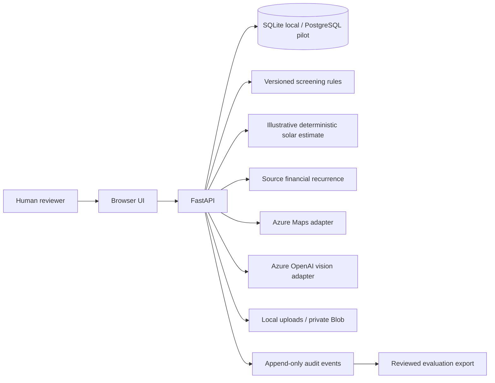
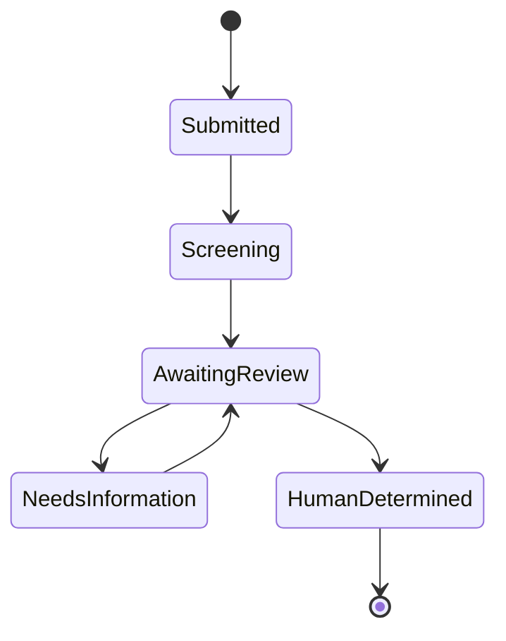

# Engineering, data, and governance guide

## Architecture

Raw user evidence, provider observations, screening output, financial output, human review, feedback, image corrections, and audit events are stored separately. Image uploads and corrections update the current screening snapshot and append before/after recommendation metadata to the audit trail. The initial recommendation is retained in `original_recommendation` and is never overwritten.

## Data dictionary

Core site fields are defined in `app/schemas.py`: stable ID; address components; parcel ID and polygon; coordinates; description; mount; roof/land/footprint area; slope/aspect; roof condition/life; tree cover/shading; ownership/site control; utility/feeder/interconnection; zoning/permitting/HOA/environment/flood/wetland concerns; capacity, production, cost, incentive and PPA values; provenance and observation time.

Blank is unknown. Zero is a measured numeric zero. `evidence_status` records evidence availability. `constraint_status` records interconnection, permitting, zoning, and environmental review as `clear`, `concern`, `blocked`, `unknown`, or `not_applicable`. Narrative text is context and is never parsed as a decision signal. Provider failure is stored as unavailable and never becomes negative evidence.

## Screening policy

`config/screening_policy.v1.json` is readable and versioned. Current thresholds are illustrative pending solar SME approval. Location must resolve. Missing candidate surface or site control yields insufficient information. Area, roof-life, shading, production, financial, structured constraint, and image concerns normally yield potentially viable. Only a server-supplied, explicitly human-confirmed approved blocker can produce preliminary not viable, and every category still awaits human review.

`app/services/solar.py` provides a deterministic desktop estimate when engineering values are absent: 18 W/sq ft for rooftop capacity, 250 kW/acre for land capacity, and 1,400 kWh/kW-year for production. These are visible illustrative assumptions, not a bankable design or location-specific irradiance model. User-supplied capacity and production remain labeled as user supplied.

Financial breakeven and solar metrics participate in recommendation evidence. Uploaded image observations trigger rescreening and can add visible-surface or shading evidence. They cannot establish legal, ownership, structural, exact-area, permitting, or utility facts. Reviewer corrections replace or reject image observations with `human_review` provenance and trigger another audited screen.

Evidence completeness counts presence of eight screening inputs. It is not calibrated success probability. When an authorized internal historical dataset is present, similar-site retrieval uses transparent token/capacity similarity rather than a trained classifier. The external handoff omits those records and safely returns no similar sites. The available source data is too small and its label provenance too weak for a defensible production classifier.

## Future learning

Export reviewed rows from `/api/exports/reviewed.csv`; never merge them into raw originals. Before training:

1. Deduplicate by stable project and parcel while retaining event history.
2. Perform blinded label-quality review without reviewer narrative as a feature.
3. Freeze train, validation, and locked holdout sets by project, not row.
4. Add a geographic holdout containing unseen counties or utility territories.
5. Report by mount type and geography; monitor false negatives as the priority harm.
6. Calibrate confidence on untouched validation/holdout data and label it model certainty.
7. Monitor input, missingness, provider, geography, label, and outcome drift.
8. Never report training-set accuracy or use post-decision comments as predictor leakage.

## Security and privacy

Local identity is explicitly demo-only. Secrets use environment variables, uploads are content-type/signature/size checked, names are sanitized, provider errors are safe, and `.env`, databases, and uploads are ignored.

Pilot controls: Microsoft Entra ID; server-side owner/reviewer/admin RBAC; managed identity; Key Vault; private Blob Storage; PostgreSQL/Azure SQL with encryption and least privilege; private endpoints and network controls; centralized append-only audit retention; PII minimization; documented retention/deletion-request workflow; Application Insights with redaction; alerting; backups and recovery tests; dependency/image scanning; threat modeling; and Responsible AI review. Never log images, addresses, tokens, provider payloads, or reviewer rationale by default.

Threat-model priorities include broken object-level authorization, malicious uploads, prompt injection in images/text, export exfiltration, idempotency abuse, provider spoofing, over-trust in AI observations, and audit tampering.

## Known limitations

- Local demo authentication is not access control.
- Parcel, footprint, canopy, terrain, flood, wetland, zoning, utility territory, and hosting-capacity adapters are placeholders.
- Uploaded files use local disk; Azure pilot needs private Blob and malware scanning.
- Azure integrations were implemented against current documented contracts but were not live-tested without credentials.
- SQLite is suitable for a demo, not concurrent production use.
- Historical labels and illustrative thresholds need SME validation.
- Solar density and specific-yield assumptions need replacement with location-specific engineering inputs before real-site use.
- The financial recurrence is parity logic, not standard DCF or financial advice.
- No production classifier is trained.
- Accepting an assessment does not yet create a downstream project record; that transition belongs to the project workflow integration.
